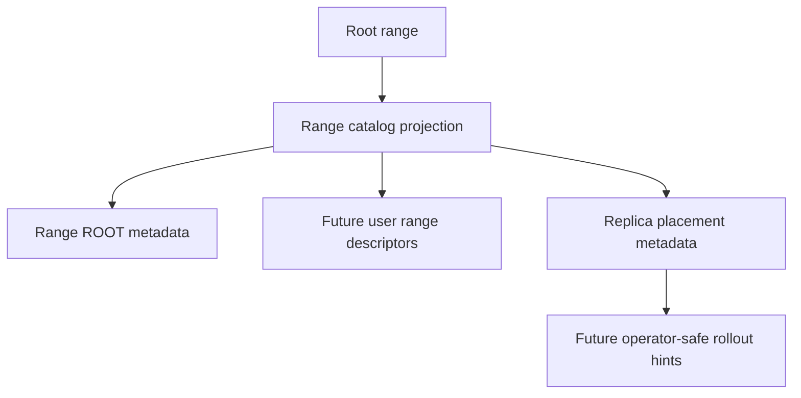

# OpenDB Milestone 2 Sprint 1 Implementation Plan

> **For agentic workers:** REQUIRED SUB-SKILL: Use superpowers:subagent-driven-development (recommended) or superpowers:executing-plans to implement this plan task-by-task. Steps use checkbox (`- [ ]`) syntax for tracking.

**Goal:** Add the first Milestone 2 database semantics: durable typed schema metadata, explicit primary key constraints, and SQL/parity coverage over the existing root-range commit stream.

**Architecture:** The canonical commit stream remains the source of truth. Schema metadata is stored inside committed `CreateTable` mutations, the rebuildable row projection enforces constraints deterministically, and pgwire exposes the behavior through the existing simple-query path. This is deliberately root-range scoped now, but the metadata shape leaves room for future range catalog descriptors and archival manifests.

**Tech Stack:** Rust, Tokio, Serde, OpenRaft-backed root range, TypeScript, Vitest, pgwire smoke tooling, Kubernetes/k3s manifests. No Python.

---

## Positioning

Milestone 1 proved a k3s-shaped Rust database node with root-range consensus, WAL durability, row projection rebuild, and minimal SQL over pgwire.

Sprint 1 of Milestone 2 should deepen the transactional contract before adding more deployment automation. The highest-leverage next step is schema metadata that can support ERP-style correctness:

- explicit column types;
- explicit primary key declaration;
- transactional constraint validation before consensus append;
- deterministic replay from WAL;
- client-visible SQL behavior over pgwire.


## Task 1: Typed Schema Metadata And Primary Key Constraint

**Files:**
- Modify: `crates/opendb-storage/src/commit_stream.rs`
- Modify: `crates/opendb-storage/src/row_projection.rs`
- Modify: `crates/opendb-sql/src/ast.rs`
- Modify: `crates/opendb-sql/src/parser.rs`
- Modify: `crates/opendb-sql/src/executor.rs`
- Modify: `crates/opendb-node/src/database.rs`
- Modify: `tools/pgwire-smoke.ts`
- Modify: `tests/parity/sql-smoke.test.ts`

- [ ] **Step 1: Write failing Rust tests for schema metadata**

Add tests that prove `CREATE TABLE accounts (id INT PRIMARY KEY, name TEXT)` stores a typed schema, rejects duplicate primary keys, and rejects values whose type does not match the column definition.

Run:

```bash
cargo test -p opendb-sql primary_key
```

Expected before implementation: FAIL because the parser/AST/projection do not expose typed schema or primary-key metadata yet.

- [ ] **Step 2: Implement typed schema in commit stream and projection**

Replace column-name-only table metadata with:

```rust
pub enum ColumnType {
    Int64,
    Text,
}

pub struct ColumnDefinition {
    pub name: String,
    pub data_type: ColumnType,
    pub primary_key: bool,
}
```

`RowProjection::apply` must reject:

- tables with no primary key;
- multiple primary keys;
- duplicate column names;
- rows missing any column;
- duplicate row key;
- values that do not match the declared `ColumnType`.

- [ ] **Step 3: Implement SQL parser/executor support**

Parser support:

```sql
CREATE TABLE accounts (id INT PRIMARY KEY, name TEXT)
CREATE TABLE accounts (id INT64 PRIMARY KEY, name TEXT)
CREATE TABLE accounts (id BIGINT PRIMARY KEY, name TEXT)
```

Executor behavior:

- use the explicit primary-key column value as the internal row key;
- reject `INSERT` before building a commit record if the primary-key value is missing or has the wrong type;
- keep existing `SELECT * FROM table` result ordering deterministic.

- [ ] **Step 4: Extend pgwire parity**

Update `tools/pgwire-smoke.ts` so the smoke path creates tables with explicit primary keys and validates that a primary-key filtered row can be round-tripped after this sprint adds filtering.

For this task, the required client-visible smoke remains:

```sql
CREATE TABLE accounts_<suffix> (id INT PRIMARY KEY, name TEXT)
INSERT INTO accounts_<suffix> VALUES (1, 'Ada')
SELECT * FROM accounts_<suffix>
```

- [ ] **Step 5: Verify and commit**

Run:

```bash
cargo fmt --all -- --check
cargo clippy --workspace --all-targets -- -D warnings
cargo test --workspace
npm run check:ts
npm run check:no-python
npm run check:manifests
npm test
```

Commit:

```bash
git add crates/opendb-storage/src/commit_stream.rs crates/opendb-storage/src/row_projection.rs crates/opendb-sql/src/ast.rs crates/opendb-sql/src/parser.rs crates/opendb-sql/src/executor.rs crates/opendb-node/src/database.rs tools/pgwire-smoke.ts tests/parity/sql-smoke.test.ts docs/superpowers/plans/2026-05-08-opendb-milestone-2-sprint-1.md
git commit -m "feat: add typed primary key schema"
git push origin main
```

## Task 2: Primary-Key Predicate Reads

**Files:**
- Modify: `crates/opendb-sql/src/ast.rs`
- Modify: `crates/opendb-sql/src/parser.rs`
- Modify: `crates/opendb-sql/src/executor.rs`
- Modify: `crates/opendb-node/src/pgwire.rs`
- Modify: `tools/pgwire-smoke.ts`

Add:

```sql
SELECT * FROM accounts WHERE id = 1
```

The executor should only support equality on the table primary key in this sprint. Unsupported predicates must fail with a SQL error instead of scanning silently.

## Task 3: Range Catalog Metadata Seed

**Files:**
- Create: `crates/opendb-storage/src/range_catalog.rs`
- Modify: `crates/opendb-storage/src/lib.rs`
- Modify: `crates/opendb-storage/src/commit_stream.rs`
- Modify: `crates/opendb-consensus/src/root_range.rs`

Add root-range-owned metadata structs for future range management:

```rust
pub struct RangeDescriptor {
    pub range_id: RangeId,
    pub parent_range_id: Option<RangeId>,
    pub key_start: Option<String>,
    pub key_end: Option<String>,
    pub replica_node_ids: Vec<u64>,
}
```

This task only persists and replays metadata; it does not route user tables across ranges yet.



## Task 4: Archival Manifest Interfaces

**Files:**
- Create: `crates/opendb-storage/src/archive_manifest.rs`
- Modify: `crates/opendb-storage/src/lib.rs`
- Modify: `crates/opendb-storage/src/commit_stream.rs`

Add serializable metadata for future native object archival:

```rust
pub enum ArchiveBackendKind {
    S3Compatible,
    GoogleCloudStorage,
    AzureBlobCompatible,
}

pub struct ArchiveObjectPointer {
    pub backend: ArchiveBackendKind,
    pub bucket: String,
    pub key: String,
    pub content_sha256: String,
}
```

This task records object pointers only. It must not upload data or add external object-storage dependencies yet.

## Verification Policy

No sprint task is complete unless these pass:

```bash
cargo fmt --all -- --check
cargo clippy --workspace --all-targets -- -D warnings
cargo test --workspace
npm run check:ts
npm run check:no-python
npm run check:manifests
npm test
```

`cargo test --workspace` may require execution outside the sandbox because OpenRaft loopback tests reserve local ports.

## Status

- Task 1 is the active implementation target.
- Tasks 2-4 are intentionally staged after Task 1 so the schema contract is stable before adding predicate reads, range descriptors, and archival metadata.
