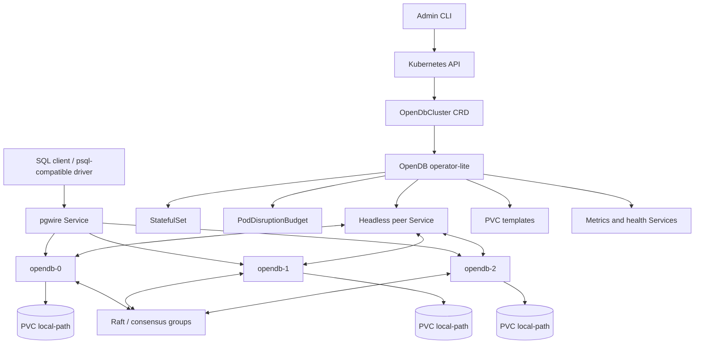
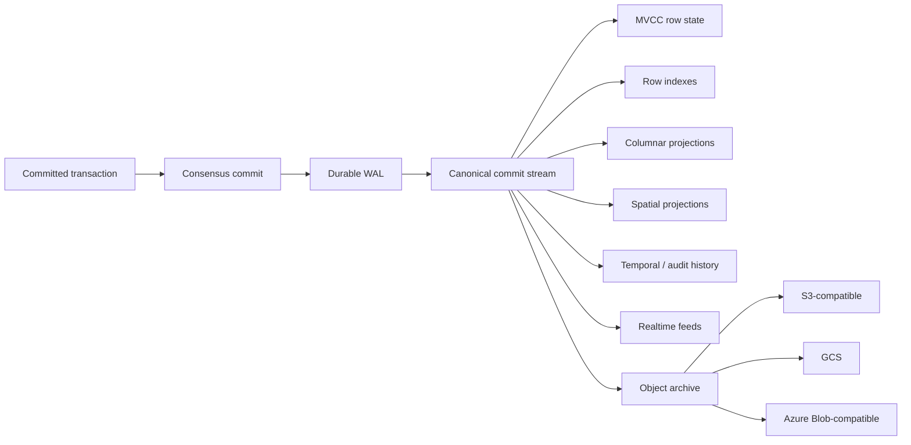
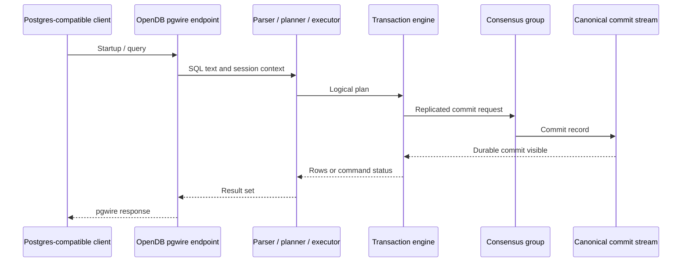
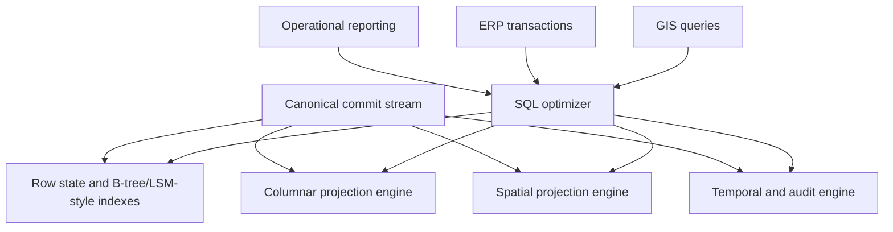
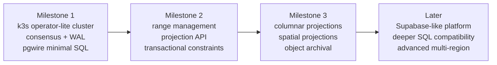

# OpenDB Design

Date: 2026-05-05

## Context

OpenDB is a new Rust database project. The initial goal is ambitious: compete with PostgreSQL and Supabase on functionality, scalability, performance, GIS, analytical workloads, and ANSI SQL compatibility.

The project deliberately prioritizes the architecture in this order:

1. Distributed SQL foundations.
2. HTAP, GIS, and ERP-grade operational analytics.
3. Supabase-like platform features.
4. PostgreSQL and ANSI SQL compatibility depth.

The first concrete deliverable is a Kubernetes-native local cluster running on k3s.

## Positioning

OpenDB is a Rust Kubernetes-native database for modern ERP and HTAP workloads. It targets strongly consistent transactions, fresh operational analytics, native GIS, progressive SQL/Postgres compatibility, native object archival, and integrated platform capabilities similar to Supabase.

OpenDB does not embed PostgreSQL, Iceberg, Pinot, Supabase, or any external database as its source of truth. It reimplements the relevant capabilities around one transactionally consistent core.

Open protocols and formats are interoperability contracts, not implementation dependencies:

- PostgreSQL wire protocol for client compatibility.
- ANSI SQL and PostgreSQL dialect compatibility over time.
- S3, GCS, and Azure Blob-compatible object storage for native archival.
- Iceberg and GeoParquet-compatible exports for lakehouse interoperability later.
- Kafka-compatible CDC as a future external integration contract.

## Non-Negotiable Constraints

- No Python anywhere in the project.
- Tooling, scripts, test harnesses, parity checks, fixtures, manifest validation, and generation must use TypeScript or Rust.
- No embedded PostgreSQL engine.
- No external database may become OpenDB's source of truth.
- Kubernetes-native deployment starts on day 1.
- An operator-lite starts on day 1.
- A canonical commit stream is the source of truth.
- Derived projections are rebuildable.
- PostgreSQL wire protocol is for client compatibility only.
- Native archival to S3, GCS, and Azure Blob-compatible backends is a core capability.
- ERP, HTAP, GIS, and platform constraints must shape internal interfaces early, even when not implemented in milestone 1.

## Strategic Approach

The chosen approach is a canonical commit stream with derived projections.

Every committed transaction produces an ordered internal event stream. Row state, row indexes, columnar projections, spatial indexes, realtime feeds, audit history, temporal views, and object archives derive from that stream. These projections may be optimized and persisted, but they are not independent sources of truth.

This avoids a patchwork architecture where OLTP, analytics, GIS, realtime, and archival each maintain separate consistency models.

Alternative approaches were rejected for the initial design:

- A distributed KV/SQL engine first would make it easier to get an early SQL cluster, but risks delaying the HTAP, ERP, and GIS differentiation.
- A platform-first Supabase-like product would create visible value quickly, but would underinvest in the distributed database foundation.

## Kubernetes-Native Architecture

OpenDB starts with an operator-lite implemented in Rust. The operator owns Kubernetes lifecycle management. The database engine owns data correctness.

The primary Kubernetes API is an `OpenDbCluster` custom resource. It declares:

- desired node count;
- storage class and volume size;
- exposed services;
- placement constraints;
- replication settings;
- image and runtime settings;
- optional archival backend configuration.

The operator reconciles:

- StatefulSets;
- persistent volume claims;
- headless peer discovery services;
- PostgreSQL wire services;
- internal RPC services;
- PodDisruptionBudgets;
- readiness and liveness probes;
- topology spread constraints;
- safe rollout settings.

The engine, not Kubernetes, owns:

- quorum;
- logical membership;
- tablet and range placement;
- leases;
- consensus;
- transaction ordering;
- recovery;
- data consistency.

The first target environment is k3s with the local-path provisioner. The design must remain portable to managed Kubernetes clusters and cloud storage classes.

## Core Data Architecture

OpenDB's durable core is organized around replicated tablets or ranges.

Each tablet contains:

- a consensus log;
- a durable WAL;
- MVCC row state;
- local metadata;
- a segment of the canonical commit stream;
- projection checkpoints.

Milestone 1 starts with one replicated root tablet/range across three nodes. This is still a distributed cluster: the root range is strongly replicated by consensus, persisted to PVC-backed storage, and recovered after pod restarts. The simplification is that all user data initially lives in one logical partition.

This proves consensus, durability, recovery, PostgreSQL wire compatibility, SQL execution, and commit stream replay without also implementing sharding, range routing, split/merge, rebalancing, and cross-range transactions in the first milestone. The internal format must still allow range split and merge later.

The canonical commit stream records:

- transaction id;
- logical timestamp;
- affected table/range keys;
- row mutations;
- schema mutations;
- security and actor metadata needed for audit;
- commit ordering metadata;
- projection checkpoints;
- archival pointers when applicable.

## Transactional Semantics

OpenDB targets ACID semantics within a cluster.

Milestone 1 should prove:

- durable writes;
- recovery after pod restart;
- consensus across three nodes;
- read-your-writes for simple transactions;
- snapshot reads if feasible;
- explicit transaction boundaries if feasible;
- deterministic commit stream replay;
- projection rebuild for the initial row projection.

Longer term, the engine must support:

- MVCC with correct visibility rules;
- distributed transactions across ranges;
- schema transactions;
- constraints and indexes;
- foreign keys;
- serializable or clearly documented isolation modes;
- temporal reads and audit retention;
- online range split and merge;
- online rolling upgrades.

## PostgreSQL Wire Compatibility

PostgreSQL wire protocol is a client compatibility boundary only.

OpenDB does not use PostgreSQL as a storage engine, query engine, extension host, runtime, or dependency. It implements its own parser, planner, executor, storage, transaction engine, replication, and operator.

The first pgwire goal is modest:

- accept client connections;
- authenticate in a simple development mode;
- parse and execute a small SQL subset;
- return compatible result frames for existing PostgreSQL clients and drivers.

## HTAP, GIS, And ERP-Grade Workloads

OpenDB targets operational HTAP, not only offline lakehouse analytics.

ERP/S4HANA-like workloads require fresh analytics on transactional data. The architecture therefore includes internal columnar projections and materialized views fed by the canonical commit stream.

The ERP-oriented data requirements include:

- exact `DECIMAL`;
- money-safe arithmetic;
- dates, timestamps, intervals, and time zones;
- constraints;
- foreign keys;
- unique indexes;
- transactional DDL over time;
- RBAC and row-level security;
- audit trails;
- temporal history;
- materialized business views;
- controlled procedures or functions.

GIS is a native projection family, not an external add-on. The long-term target includes:

- geometry and geography types;
- spatial indexes;
- bounding-box filtering;
- OGC-style predicates;
- spatial joins;
- analytical export to GeoParquet-compatible files.

## Native Object Archival

Object archival is a core capability, not an afterthought.

OpenDB must support policies that move historical segments, snapshots, audit records, projection checkpoints, and analytical exports to object storage.

Target backends:

- S3-compatible storage;
- Google Cloud Storage;
- Azure Blob-compatible storage.

Initial k3s development may use MinIO later, but milestone 1 does not need to deploy object storage unless required by implementation tests.

Archival must preserve enough metadata to support future:

- point-in-time recovery;
- historical query;
- compliance retention;
- cold data restore;
- lakehouse export;
- GeoParquet-compatible spatial analytics.

## Platform Layer

Supabase-like capabilities are planned after the core distributed database foundation.

Future platform capabilities include:

- Auth;
- row-level security;
- realtime subscriptions;
- storage metadata;
- generated REST and GraphQL APIs;
- dashboard and admin surfaces;
- SDKs.

These features must consume the same database primitives rather than become unrelated services. Realtime, audit, and generated APIs should use the commit stream and SQL metadata.

## Milestone 1

Milestone 1 must produce a local k3s cluster, not only a library.

Scope:

- Rust workspace scaffold.
- Operator-lite Rust crate.
- `OpenDbCluster` CRD minimal schema.
- k3s deployment manifests.
- StatefulSet for three OpenDB nodes.
- stable pod identities.
- PVC local-path storage.
- headless peer service.
- PostgreSQL wire service.
- readiness and liveness probes.
- minimal consensus over one replicated root range/tablet.
- WAL durability.
- pod restart recovery.
- canonical commit stream version 1.
- rebuildable row projection.
- minimal SQL over pgwire.
- TypeScript tooling for parity and cluster checks.

Candidate SQL subset:

- `CREATE TABLE` with a small set of types;
- `INSERT`;
- `SELECT` without complex joins;
- simple `BEGIN` / `COMMIT` if feasible;
- simple primary key or implicit row id.

Non-goals:

- full SQL ANSI compatibility;
- full PostgreSQL dialect;
- sharding automation;
- multi-range routing;
- range split and merge;
- cross-range transactions;
- multi-region;
- complete operator lifecycle automation;
- full HTAP engine;
- complete GIS;
- Supabase-like dashboard;
- advanced snapshots and backups;
- object archival implementation unless needed for early interfaces.

## Testing And Verification

Testing must avoid Python.

Rust tests should cover:

- WAL encode/decode;
- commit stream replay;
- MVCC visibility;
- consensus state transitions;
- projection rebuild;
- SQL execution units.

TypeScript tests should cover:

- k3s deployment checks;
- CRD manifest validation;
- pgwire compatibility smoke tests;
- SQL parity fixtures;
- cluster restart scenarios;
- CLI workflows.

No milestone is complete without executable verification.

## Open Decisions For The Implementation Plan

The design leaves several implementation choices for the next planning phase:

- exact Rust workspace crate layout;
- consensus implementation strategy;
- storage engine implementation strategy;
- SQL parser strategy;
- pgwire crate or from-scratch protocol implementation;
- operator framework choice in Rust;
- TypeScript test runner and manifest validation stack;
- local k3s bootstrap expectations;
- whether milestone 1 includes a MinIO-backed archival stub or no object store at all.

These are planning decisions, not product design blockers.
