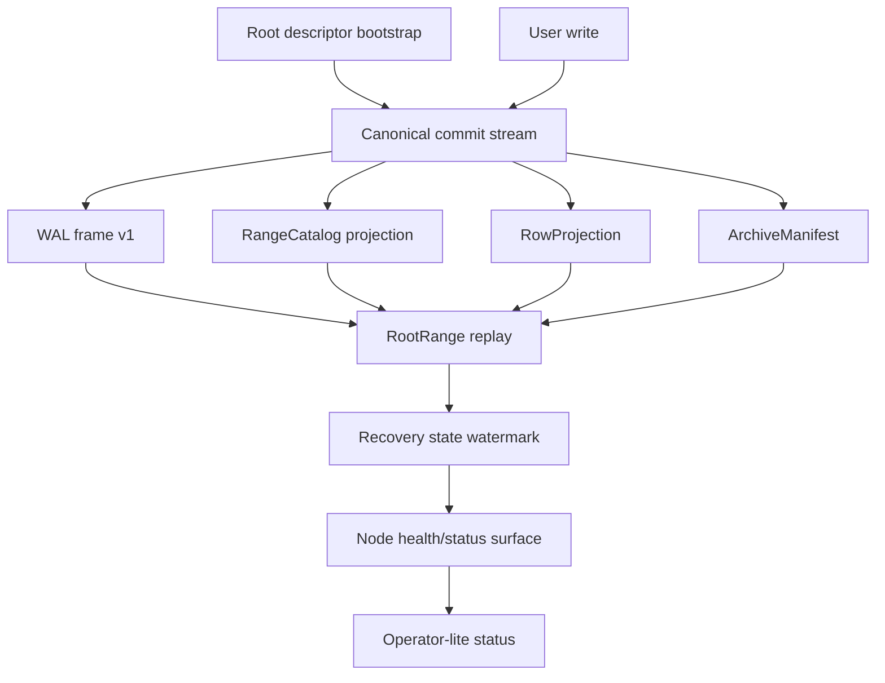
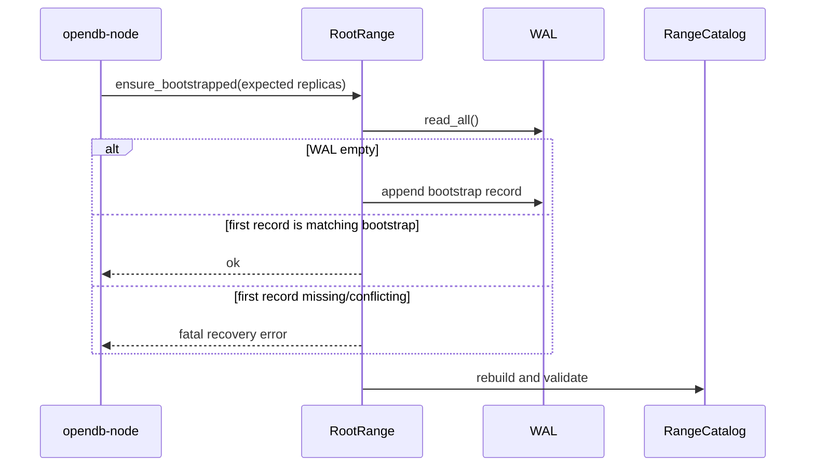
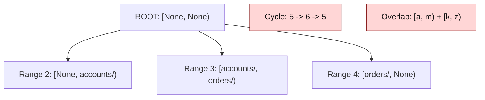
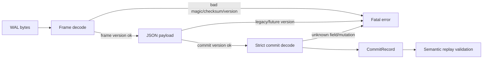
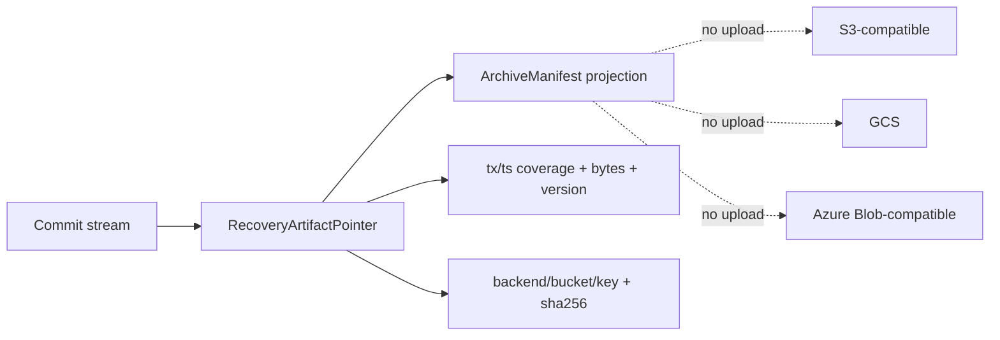

# OpenDB Milestone 2 Sprint 2 Design

Date: 2026-05-09

## Goal

Milestone 2 Sprint 2 stabilizes the recovery contract around the root range before OpenDB
adds multi-range routing, split/merge, snapshots, or object-storage clients.

The sprint does not add visible SQL surface area for end users. It makes the
metadata layer strict enough that later features can be added without silently
corrupting replay, range ownership, or archive recovery.

## Context

Sprint 1 added typed primary-key schema, primary-key predicate reads, a seed
range catalog, and archive object pointer metadata. The current implementation
already validates basic descriptor shape, WAL frame checksums, and rebuildable
projections.

The remaining gap is that several contracts are still implicit:

- the root range is not bootstrapped as explicit catalog metadata;
- range descriptors are upserts without full tree or overlap validation;
- WAL frame version, commit record version, and Raft state version have no
  documented compatibility matrix;
- archive metadata identifies objects but not the recoverable artifact they
  contain;
- Kubernetes status reports liveness/readiness, not recovery state.

## Non-Goals

- No PostgreSQL engine or internal PostgreSQL tooling.
- No Python scripts, tests, generators, or fixtures.
- No S3, GCS, Azure Blob, MinIO, Kafka, Iceberg, or external database
  dependency.
- No cross-range transaction routing.
- No range split/merge operation.
- No Raft snapshot installation yet.
- No object upload or download.

## Design Summary

Sprint 2 introduces three explicit contracts:

1. A root catalog contract: the root descriptor is bootstrapped once, then the
   range catalog rejects invalid trees, cycles, conflicting descriptor updates,
   and sibling overlaps.
2. A storage compatibility contract: WAL frames, commit records, and Raft state
   are versioned independently, decoded strictly, and protected by golden byte
   fixtures.
3. A recovery artifact contract: archive metadata describes recoverable WAL,
   snapshot, and checkpoint artifacts without becoming a storage client or a
   second source of truth.

## Root Descriptor Bootstrap

The root range must exist as explicit metadata in the commit stream before user
metadata or user rows are accepted.

The bootstrap record is a system record:

- `tx_id = 0`;
- `ts = 0`;
- `range_id = RangeId::ROOT`;
- `actor = "system"`;
- exactly one mutation: `PutRangeDescriptor` for `RangeId::ROOT`.

The root descriptor contract is:

- `range_id = RangeId::ROOT`;
- `parent_range_id = None`;
- `key_start = None`;
- `key_end = None`;
- `replica_node_ids` is sorted and unique;
- standalone local mode uses `[0]`;
- OpenRaft mode uses the sorted initial peer ids.

Bootstrap must be idempotent. Reopening a node must not append a second root
descriptor if the existing first record already matches the expected root
descriptor. A conflicting existing root descriptor is fatal and must not be
silently rewritten.

## Range Catalog Contract

`PutRangeDescriptor` remains the only descriptor mutation in Sprint 2, but it
is no longer a loose upsert.

Descriptor invariants:

- exactly one root descriptor exists;
- every non-root descriptor has an existing parent;
- the parent graph is acyclic;
- descriptor ids are immutable after creation;
- parent id and bounds are immutable after creation;
- duplicate descriptors in one record are accepted only when byte-for-byte
  identical;
- replica updates are deferred to a future typed mutation and are rejected when
  they conflict with an existing descriptor.

Bounds use half-open intervals: `[key_start, key_end)`.

`None` means an unbounded edge. Root is the only descriptor with both bounds
unset and no parent. Non-root descriptors may use an unbounded edge only when it
matches an unbounded edge of the parent. This allows future first/last range
children under an unbounded parent without inventing sentinel keys.

Sibling ranges under the same parent must not overlap. Gaps are allowed in
Sprint 2 because OpenDB does not yet have split/merge operations that declare a
complete partition. Exact coverage becomes part of the future `SplitRange` and
`MergeRange` contract.

## Commit Stream And WAL Compatibility

OpenDB has three independent persistent version domains:

| Domain | Current Version | Owner | Sprint 2 Policy |
| --- | ---: | --- | --- |
| WAL frame | 1 | `opendb-storage::wal` | controls bytes, frame header, checksum |
| Commit record | 2 | `opendb-storage::commit_stream` | controls semantic record JSON |
| Raft state | existing store version | `opendb-consensus::raft` | controls local OpenRaft store state |

The compatibility policy is intentionally strict:

- OpenDB writes only the current versions.
- Future versions are fatal.
- Legacy commit version 1 is fatal unless an explicit Rust migration tool is
  added.
- Unknown mutation variants are fatal.
- Unknown fields in persisted record structs are fatal unless a dedicated
  `extensions` field is introduced.
- `Wal::read_all()` never repairs the file.
- `Wal::append()` may truncate only a final torn frame that has no valid JSON
  payload and no valid checksum.
- Bad magic, bad checksum, future version, legacy semantic version, and unknown
  fields are corruption/compatibility errors, not truncation candidates.

Golden fixtures must cover complete WAL bytes, not only inline JSON payload
strings. Fixture generation and validation must be Rust or TypeScript only.

## Commit Ordering Contract

WAL order is the canonical commit order.

Sprint 2 also makes lightweight ordering fields enforceable:

- the bootstrap record is the only allowed `(tx_id = 0, ts = 0)` record;
- user records must have non-empty mutations;
- user records must have non-empty, trimmed `actor`;
- user record `tx_id` values must be strictly increasing in WAL order;
- user record `ts` values must be strictly increasing in WAL order.

This is not the final MVCC clock model. It is an early recovery invariant that
prevents forged or accidental WAL records from replaying into a state that
cannot support audit, PITR, or deterministic projection rebuilds.

## Recovery Artifact Metadata

`ArchiveObjectPointer` is currently enough to identify an object but not enough
to prove that the object is useful for recovery. Sprint 2 extends the metadata
model with a recovery artifact description while keeping the archive manifest a
pure projection of the commit stream.

The recovery artifact contract should describe:

- artifact kind: `wal_segment`, `snapshot`, or `projection_checkpoint`;
- target `range_id`;
- object backend, bucket, key, and SHA-256 hash;
- artifact format version;
- covered commit `tx_id` range;
- covered logical timestamp range;
- record count;
- byte length;
- compression kind, initially `none`.

Archive metadata remains declarative. It does not upload, download, verify
remote existence, or use a cloud SDK in Sprint 2.

Conflict handling:

- same backend, bucket, key, hash, and coverage is idempotent;
- same backend, bucket, key with different hash or coverage is rejected;
- overlapping recoverable artifacts for the same `range_id` and `artifact_kind`
  are rejected unless a future compaction/supersession mutation explicitly
  permits it.

## Snapshot And Checkpoint Boundary

Sprint 2 may define snapshot and projection checkpoint metadata, but it must not
enable Raft snapshot installation yet.

A snapshot or checkpoint is recoverable only if it references an exact prefix of
the canonical commit stream. Recovery from a snapshot is therefore:

1. trust a local or archived artifact only after its metadata validates;
2. restore the snapshot/checkpoint state for commits `0..N`;
3. replay canonical commit stream records from `N+1`;
4. rebuild derived projections deterministically.

Until this is implemented, WAL replay remains the only recovery mechanism.

## Kubernetes And k3s Contract

OpenDB remains Kubernetes-compatible from the start, but Kubernetes must not own
database correctness.

Sprint 2 keeps the operator-lite simple:

- Kubernetes readiness means the pod can serve leader-owned client traffic;
- Kubernetes liveness means the process is alive;
- `OpenDbCluster.status.phase = Ready` means desired pods are running and a
  leader is known;
- recovery state is a database-engine contract and should be exposed separately
  before the operator reports deeper recovery conditions.

The next minimal kube-visible recovery surface is a node status endpoint or
health body that reports:

- root descriptor known;
- WAL replay completed;
- last replayed `tx_id`;
- last replayed `ts`;
- archive metadata replayed;
- latest known recovery artifact, when any exists.

The operator can later reflect this into conditions such as `Recovered`,
`RootDescriptorKnown`, and `ArchiveMetadataKnown`. Sprint 2 should not make
`OpenDbCluster Ready` depend on object storage.

k3s UAT remains PVC/local-path only. The new UAT expectation is restart safety:

1. create table and insert rows through pgwire service;
2. restart or delete the current leader pod;
3. wait for a leader and `OpenDbCluster Ready`;
4. query the previously inserted rows through the service.

No MinIO or cloud object storage is required for Sprint 2 UAT.

## Test Strategy

Storage tests:

- root descriptor bootstrap record shape;
- range catalog rejects parent cycles;
- range catalog rejects conflicting descriptor updates;
- range catalog rejects sibling overlaps;
- range catalog allows adjacent siblings;
- range catalog allows gaps until split/merge exists;
- archive manifest rejects conflicting recovery artifact coverage.

WAL and compatibility tests:

- full-byte golden fixture for frame v1 plus commit record v2;
- future commit versions are rejected without truncation;
- legacy v1 create-table shape is rejected with a migration-oriented error;
- unknown mutation variants are rejected;
- unknown fields in known persisted structs are rejected;
- append truncates only a torn final frame.

Consensus/root-range tests:

- bootstrap appends exactly once;
- bootstrap rejects conflicting first descriptor;
- user commits before bootstrap are rejected;
- replay rejects non-monotonic `tx_id` or `ts`;
- replay rejects empty mutation records;
- replay rejects forged catalog cycles and overlaps;
- OpenRaft bootstrap descriptor replicas match initial peer ids.

Kubernetes and TypeScript tests:

- manifest checks stay static and k3s-compatible;
- UAT docs cover restart-based recovery;
- no Python files or scripts are introduced.

## Review Points

The important review points before implementation are:

1. `tx_id = 0` and `ts = 0` are reserved for the root bootstrap record.
2. `PutRangeDescriptor` becomes effectively immutable after creation in Sprint
   2; future replica or split operations must use typed mutations.
3. Sibling overlaps are rejected now; sibling gaps remain allowed until
   split/merge declares exact coverage.
4. Unknown persisted fields are fatal; compatibility is explicit, not best
   effort.
5. Archive metadata describes recoverable artifacts but does not add object
   storage clients.
6. `OpenDbCluster Ready` remains a kube readiness condition, not a full database
   recovery guarantee.

## Acceptance Criteria

Sprint 2 is complete when:

- root-range startup cannot accept user commits before an explicit root
  descriptor exists;
- range catalog replay is deterministic and rejects invalid trees;
- WAL and commit compatibility behavior is documented and protected by golden
  fixtures;
- recovery artifact metadata can prove what commit range an archived object
  covers;
- k3s docs include a restart recovery UAT;
- all Rust, TypeScript, manifest, and no-Python checks pass.
