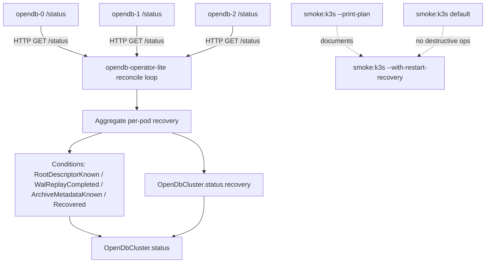

# OpenDB Milestone 2 Sprint 3 Design

Date: 2026-05-09

## Goal

Milestone 2 Sprint 3 closes the kube-visible recovery loop opened in Sprint 2 by
having the operator-lite consume each node's `/status` endpoint and reflect the
recovery contract into the `OpenDbCluster` resource as standard Kubernetes
conditions and a recovery summary block.

The sprint does not introduce object storage, multi-range routing, snapshot
installation, or any change to the canonical commit stream. It makes the
existing recovery metadata observable end-to-end through `kubectl`.

## Context

Sprint 2 made the recovery contract explicit at the storage and node layers:

- the root descriptor is bootstrapped before any user record;
- the range catalog rejects invalid trees;
- WAL frames and commit records are decoded strictly with golden fixtures;
- archive metadata describes recoverable artifacts without touching cloud
  storage;
- node `/status` exposes a JSON recovery watermark
  (`rootDescriptorKnown`, `walReplayCompleted`, `lastReplayedTxId`,
  `lastReplayedTs`, `archiveMetadataReplayed`, `latestRecoveryArtifact`).

The remaining gap is that this signal is only observable per pod, by hitting
the health port directly. The operator currently reports `phase`, `leaderPod`,
`Ready`, and `LeaderKnown`, but not recovery state. `OpenDbCluster Ready`
remains a kube readiness condition, not a database recovery guarantee, and that
contract must be preserved.

## Non-Goals

- No PostgreSQL engine or internal PostgreSQL tooling.
- No Python scripts, tests, generators, or fixtures.
- No S3, GCS, Azure Blob, MinIO, Kafka, Iceberg, or external database
  dependency.
- No new mutation in the canonical commit stream.
- No change to range catalog, WAL, archive manifest, recovery artifact
  validation, or pgwire compatibility.
- No range split/merge, snapshot installation, or cross-range routing.
- No object upload or download.
- No coupling between recovery state and `OpenDbCluster.status.phase`.
  `phase` remains driven by kube readiness only.
- No destructive default in `npm run smoke:k3s`.

## Design Summary

Sprint 3 adds three pieces, all on the operator side and the smoke tooling:

1. A per-pod recovery status fetcher: the operator polls each running pod's
   `/status` HTTP endpoint and parses the existing `RecoveryStatus` JSON.
2. A cluster-level recovery aggregation: per-pod statuses are aggregated into
   four new conditions (`RootDescriptorKnown`, `WalReplayCompleted`,
   `ArchiveMetadataKnown`, `Recovered`) and a recovery summary block on
   `OpenDbCluster.status`.
3. An opt-in restart recovery UAT in the k3s smoke tool, gated behind an
   explicit flag so the default smoke remains non-destructive.



## Per-Pod Recovery Status Fetcher

The operator already lists `Pod` objects scoped by the OpenDbCluster instance
label selector. Sprint 3 keeps that list, adds the pod IP, and dials each
running pod's health port to GET `/status`.

The fetcher is its own small unit:

- input: `pod_name`, `pod_ip`, `health_port`, `timeout`;
- output: `Result<RecoveryStatus, FetchError>`;
- transport: tokio TCP + an HTTP/1.1 GET written and parsed manually,
  mirroring `crates/opendb-node/src/health.rs`. No new HTTP dependency.

The fetcher is exposed behind a trait so unit and integration tests can
substitute an in-process fake. The production implementation is a thin struct.

Rules:

- only running pods are dialed (`node_running == true`);
- failures (timeout, refused, parse error, non-200) are tolerated and recorded
  as `Unknown` for that pod, not as a False condition;
- HTTP timeout is short (default 2s) so the reconcile loop never blocks on a
  hanging pod;
- per-pod fetches run concurrently inside one reconcile tick.

## Cluster Recovery Aggregation

The operator computes a `ClusterRecoveryAggregate` from observed per-pod
statuses:

```text
ClusterRecoveryAggregate {
    observed_running_pods: i32,
    root_descriptor_known_pods: i32,
    wal_replay_completed_pods: i32,
    archive_metadata_replayed_pods: i32,
    unreachable_pods: i32,
    last_replayed_tx_id: Option<u64>,        // max across pods
    last_replayed_ts: Option<u64>,           // max across pods
    latest_recovery_artifact: Option<String>, // first non-null seen, deterministic by pod name
}
```

A condition flips to `True` only when **all observed running pods** report the
corresponding flag. A condition is `Unknown` when any running pod is
unreachable or returned an unparseable status. A condition is `False` only
when at least one running pod explicitly reports `false` and no running pod is
unreachable.

| Condition | True when | False when | Unknown when |
| --- | --- | --- | --- |
| `RootDescriptorKnown` | every running pod reports `rootDescriptorKnown=true` | any running pod reports `false` and none are unreachable | any running pod is unreachable |
| `WalReplayCompleted` | every running pod reports `walReplayCompleted=true` | any running pod reports `false` and none are unreachable | any running pod is unreachable |
| `ArchiveMetadataKnown` | every running pod reports `archiveMetadataReplayed=true` | any running pod reports `false` and none are unreachable | any running pod is unreachable |
| `Recovered` | `Ready=True` AND the three above are `True` | `Ready=False` or any of the three above is `False` | any of the three above is `Unknown` |

## OpenDbClusterStatus Shape Changes

`OpenDbClusterStatus` gains an optional `recovery` block. Existing fields
(`readyReplicas`, `phase`, `leaderPod`, `conditions`) are unchanged in
semantics. JSON example:

```json
{
  "readyReplicas": 3,
  "phase": "Ready",
  "leaderPod": "opendb-0",
  "recovery": {
    "rootDescriptorKnownReplicas": 3,
    "walReplayCompletedReplicas": 3,
    "archiveMetadataReplayedReplicas": 3,
    "unreachableReplicas": 0,
    "lastReplayedTxId": 7,
    "lastReplayedTs": 7,
    "latestRecoveryArtifact": null
  },
  "conditions": [
    { "type": "Ready", "status": "True", "reason": "ClusterReady", "message": "..." },
    { "type": "LeaderKnown", "status": "True", "reason": "LeaderKnown", "message": "..." },
    { "type": "RootDescriptorKnown", "status": "True", "reason": "AllReplicasReportRoot", "message": "..." },
    { "type": "WalReplayCompleted", "status": "True", "reason": "AllReplicasReplayed", "message": "..." },
    { "type": "ArchiveMetadataKnown", "status": "True", "reason": "AllReplicasReportedArchive", "message": "..." },
    { "type": "Recovered", "status": "True", "reason": "RecoveredAndReady", "message": "..." }
  ]
}
```

The `recovery` field is omitted from the JSON when no running pod has been
observed yet, preserving the current empty-status footprint for fresh clusters.

The condition list is stable in order. Existing fields are preserved bit-for-bit
when no recovery change occurs, so consumers that already read `phase`,
`leaderPod`, `Ready`, and `LeaderKnown` continue to work.

`OpenDbClusterCondition` gains an optional `lastTransitionTime` field
(`Option<Time>`), populated by the operator when a condition flips. Pre-existing
condition consumers ignoring unknown fields are unaffected; the manifest
JSON-Schema is updated to allow the new field.

## Phase Semantics Stay Decoupled

`phase` continues to be derived from `readyReplicas`, `desired_replicas`, and
`leader_pod` only. A cluster can be `phase=Ready` while
`Recovered=Unknown` (for example during a reconcile tick where a pod is
unreachable). This is intentional: `phase` reports kube readiness, recovery
conditions report database recovery state. They are read together, never
conflated.

## Restart Recovery UAT Opt-In

`tools/k3s-smoke.ts` already prints a restart recovery plan section. Sprint 3
adds an opt-in execution mode:

- new flag `--with-restart-recovery` on the smoke command;
- when absent (the default), behavior is identical to today: plan documents the
  scenario, execution does not delete pods, write a row, or wait on the
  `Recovered` condition;
- when present, the smoke executes:
  1. open a pgwire port-forward and create the `recovery_smoke` table if
     missing;
  2. insert a known row;
  3. resolve the current leader pod from `OpenDbCluster.status.leaderPod`;
  4. `kubectl delete pod <leader>` in the namespace;
  5. wait until `OpenDbCluster.status.conditions[type=Recovered].status` is
     `True` and `phase=Ready` with a leader, within the smoke timeout;
  6. open a fresh port-forward and `SELECT` the previously inserted row;
  7. fail the smoke if the row is missing or the conditions never converge.

The plan output is enriched to mention the flag and the non-destructive
default. The smoke command refuses `--with-restart-recovery` against
non-allowed kube contexts unless `--allow-nonlocal-context` is also set, the
same guardrail as the rest of the smoke tool.

## Test Strategy

Rust unit tests in `opendb-operator`:

- aggregation function returns expected condition statuses for combinations
  (all reachable + all true, mixed False, any Unknown);
- aggregation defaults to no `recovery` block when no running pod is observed;
- `lastReplayedTxId` / `lastReplayedTs` aggregate as max-across-pods;
- `latestRecoveryArtifact` is deterministic by pod name when set on multiple
  pods.

Rust unit tests for the recovery status fetcher trait:

- a fake implementation feeds the aggregator and existing reconcile harness;
- the production fetcher is exercised against an in-process tokio TCP server
  that returns scripted responses (success, 404, slow-then-timeout, malformed
  JSON, unknown JSON field).

Cluster-level Rust test for status patching:

- patch payload includes `recovery` and the new conditions when at least one
  running pod has been observed;
- patch payload omits `recovery` when no pod has been observed;
- the new `lastTransitionTime` is set on flips and stable across no-op
  reconciles.

TypeScript tests:

- `tests/cluster/k3s-smoke.test.ts` asserts the printed plan describes the
  `--with-restart-recovery` flag and the non-destructive default, and that the
  default smoke does not call `kubectl delete pod`;
- a new `tests/cluster/restart-recovery.test.ts` exercises the smoke options
  parser for the new flag and the wiring of the recovery wait against a fake
  `kubectl get` JSON output;
- `npm run check:manifests` continues to validate the CRD JSON-Schema after the
  optional `recovery` block and `lastTransitionTime` field are added.

No Python files are introduced. No new external dependency is added to the
operator beyond what `kube` already pulls in.

## Operator Health Endpoint

The operator binary already runs without its own HTTP surface; this stays
unchanged. Sprint 3 does not add an operator-side `/status`. All observability
remains in node `/status` and `OpenDbCluster.status`.

## Review Points

The important review points before implementation are:

1. The operator never writes to the canonical commit stream. Sprint 3 is
   read-only at the database layer.
2. `phase` semantics are unchanged. `Recovered` is a separate condition.
3. Unreachable pods produce `Unknown` conditions, not `False`. This matters
   during rolling restarts and pod deletion, especially under the restart
   recovery UAT.
4. The restart recovery UAT is opt-in. `npm run smoke:k3s` keeps its current
   non-destructive behavior.
5. No new HTTP dependency is required: the operator reuses tokio TCP + manual
   HTTP/1.1, mirroring the node implementation.
6. The CRD JSON-Schema gains optional fields. Existing manifests and consumers
   continue to validate and parse.

## Acceptance Criteria

Sprint 3 is complete when:

- the operator polls each running pod's `/status` and aggregates the result;
- `OpenDbCluster.status.conditions` includes
  `RootDescriptorKnown`, `WalReplayCompleted`, `ArchiveMetadataKnown`, and
  `Recovered`, with `lastTransitionTime` populated on flips;
- `OpenDbCluster.status.recovery` summary is populated when at least one
  running pod has been observed and omitted otherwise;
- `phase` is unchanged in semantics and does not depend on recovery;
- `tools/k3s-smoke.ts` exposes `--with-restart-recovery`, off by default, and
  enforces the local kube context allow-list;
- the printed plan documents the flag and the non-destructive default;
- all Rust, TypeScript, manifest, and no-Python checks pass.
