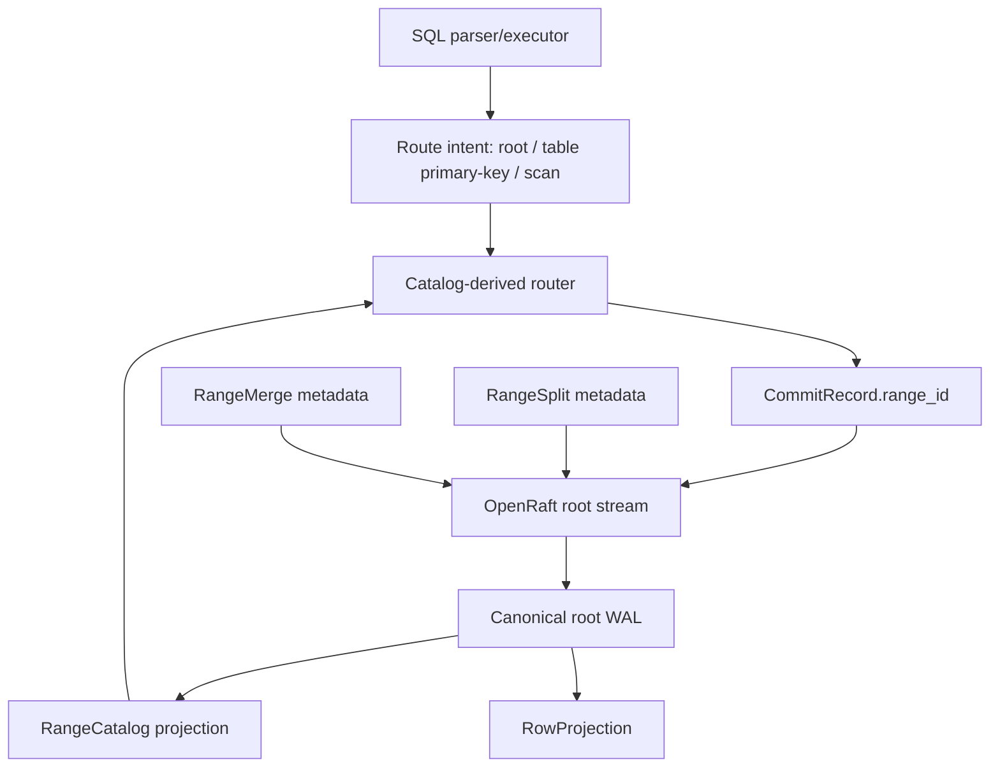

# OpenDB Milestone 2 Sprint 4 Design

Date: 2026-05-11

## Goal

Milestone 2 Sprint 4 introduces the first multi-range contract on top of the
single canonical commit stream: typed split/merge metadata and catalog-derived
logical routing for row operations.

The sprint keeps the physical deployment deliberately small. There is still one
OpenRaft-backed canonical root stream and one WAL path per node. New range
identifiers are logical ownership metadata inside that stream, not independent
consensus groups, not separate WALs, and not a second source of truth.

## Context

Milestone 1 and the first three Milestone 2 sprints already established:

- a k3s-compatible 3-node deployment with an operator-lite;
- a replicated OpenRaft root range;
- a strict canonical WAL and commit record format;
- typed primary-key table metadata and deterministic row projection replay;
- a strict range catalog projection with root bootstrap, descriptor shape,
  parent graph, and sibling overlap validation;
- metadata-only archive and recovery artifact pointers;
- node `/status` and operator `OpenDbCluster.status.conditions` for recovery
  visibility;
- an opt-in restart recovery smoke path guarded by
  `--with-restart-recovery`.

The remaining gap before physical sharding is that user records still carry
`RangeId::ROOT`, SQL execution does not expose route intent, and the range
catalog cannot describe a range split or merge as a typed event. Sprint 4 closes
that metadata and routing gap without adding physical range placement or
cross-range transactions.

## Non-Goals

- No PostgreSQL engine or internal PostgreSQL dependency.
- No Python scripts, tests, generators, or fixtures.
- No S3, GCS, Azure Blob, MinIO, Kafka, Iceberg, or external database
  dependency.
- No object upload, download, compaction, retention, or real archive policy.
- No new pgwire protocol behavior beyond the existing edge compatibility path.
- No pgwire use inside the database core.
- No physical sharding, range-local WALs, range-local Raft groups, or
  rebalancing.
- No cross-range transaction protocol.
- No SQL syntax for `SPLIT RANGE` or `MERGE RANGE` in this sprint.
- No Raft snapshot installation.
- No operator-owned correctness logic.
- No change to `OpenDbCluster.status.phase` semantics.
- No destructive default in `npm run smoke:k3s`.
- No static Kubernetes manifest change unless a verification-only manifest
  assertion is required.

## Design Summary

Sprint 4 adds four pieces:

1. Typed range operation metadata in the canonical commit stream:
   `RangeSplit` and `RangeMerge` mutations.
2. An active range catalog projection that derives current routing leaves from
   descriptor, split, and merge metadata while keeping historical descriptors
   replayable.
3. SQL route intent emitted by the executor and resolved by the node from the
   rebuilt range catalog before commit or read handling.
4. Root stream validation that accepts known logical non-root `range_id`
   records and rejects records whose range id does not match catalog-derived
   routing.



The commit stream remains canonical. Range ids annotate ownership and future
placement, but all current data still commits through the root stream and
replays from the same WAL.

## Canonical Key Routing

Sprint 4 defines the first stable logical route key:

```text
<table>/<primary-key-as-storage-key>
```

Examples:

- table `accounts`, integer primary key `1` -> `accounts/1`;
- table `sessions`, text primary key `a=b` -> `sessions/a=b`.

The route key is only an internal catalog key. It is not exposed through pgwire
and is not a final SQL collation, encoding, or index format. It is intentionally
simple so split bounds can use strings such as `accounts/`, `orders/`, or
`sessions/m`.

The SQL executor emits route intent, not a final range decision:

- `CREATE TABLE` -> root metadata route;
- `INSERT` -> table primary-key route key;
- `SELECT * FROM table WHERE <pk> = <literal>` -> table primary-key route key;
- `SELECT * FROM table` -> scan route.

The node resolves the intent against the catalog rebuilt from the canonical WAL.
For scan routes, Sprint 4 keeps execution on the single row projection and uses
the root stream as the safe default because there is no physical per-range
projection yet.

## Range Operation Metadata

The commit stream gains two typed metadata payloads:

```rust
pub struct RangeSplit {
    pub source_range_id: RangeId,
    pub split_key: String,
    pub left: RangeDescriptor,
    pub right: RangeDescriptor,
}

pub struct RangeMerge {
    pub source_range_ids: Vec<RangeId>,
    pub merged: RangeDescriptor,
}
```

`RangeSplit` declares that an active source range is covered by exactly two
child descriptors. The child descriptors are ordinary `RangeDescriptor` values,
so replica placement metadata continues to live in the catalog.

`RangeMerge` declares that two or more active sibling ranges are replaced by
one active descriptor with the same parent.

The mutation names are operation names, not object-store-style puts:

```rust
pub enum Mutation {
    ...
    SplitRange { split: RangeSplit },
    MergeRanges { merge: RangeMerge },
}
```

The commit record version remains `2` in this sprint. This is an additive
development-line expansion guarded by strict serde decoding. A pre-Sprint-4
binary will reject the new mutation variant if it sees a Sprint-4 WAL, which is
acceptable before OpenDB has a rolling-upgrade compatibility policy. A future
compatibility sprint can introduce explicit feature gates or migrations before
external releases depend on mixed binaries.

## Range Catalog Projection

`RangeCatalog` remains a rebuildable projection from the canonical stream. It
tracks:

- all descriptors ever introduced by id;
- active logical routing leaves;
- split and merge lineage for validation and debugging.

Historical descriptors are retained because the commit stream is append-only.
This means sibling overlap validation must distinguish historical descriptors
from active routing leaves. Two inactive descriptors may overlap a merged
descriptor in history, but two active siblings under the same parent must not
overlap.

Active routing rules:

- the root descriptor always exists after bootstrap and is a fallback route;
- descriptors introduced directly by `PutRangeDescriptor` become active unless
  later replaced by a split or merge;
- a split removes `source_range_id` from the active set and inserts the left and
  right descriptors;
- a merge removes all source ranges from the active set and inserts the merged
  descriptor;
- route lookup chooses the deepest active descriptor whose bounds contain the
  route key, falling back to root when no child range covers the key.

`RangeCatalog::route_key(&str)` returns the selected `RangeId` and descriptor.
It never mutates state and never consults pgwire, SQL syntax, Kubernetes, or
object storage.

## Split Validation

A split is accepted only when all of these are true:

- the source descriptor exists;
- the source range is active;
- `split_key` is non-empty and strictly inside the source bounds;
- the left and right descriptors are new ids;
- both child descriptors have `parent_range_id = Some(source_range_id)`;
- left bounds are `[source.key_start, split_key)`;
- right bounds are `[split_key, source.key_end)`;
- each child descriptor satisfies existing descriptor shape rules;
- active sibling ranges remain non-overlapping after the split;
- the record itself uses `range_id = RangeId::ROOT` because split metadata is
  root-catalog metadata.

Splitting the root descriptor is allowed. The root remains the catalog root and
fallback descriptor; its children become the active leaves for covered keys.

## Merge Validation

A merge is accepted only when all of these are true:

- at least two source range ids are provided;
- all sources exist;
- all sources are active;
- all sources share the same parent;
- all source ranges are contiguous in key order with no gap or overlap;
- the merged descriptor id is new;
- the merged descriptor has the shared parent;
- the merged descriptor bounds exactly cover the first source start through the
  last source end;
- the merged descriptor satisfies existing descriptor shape rules;
- active sibling ranges remain non-overlapping after the merge;
- the record itself uses `range_id = RangeId::ROOT` because merge metadata is
  root-catalog metadata.

Merging the root descriptor is not allowed because root is the permanent
catalog anchor.

## Commit Stream And Root Range Validation

The root stream continues to validate:

- the first record is the expected root bootstrap record;
- `tx_id` and logical timestamp increase strictly after bootstrap;
- user records have non-empty mutations and non-empty actor;
- WAL and commit JSON decode strictly;
- row projection, archive manifest, and range catalog rebuilds are deterministic.

Sprint 4 changes the previous `record.range_id == RangeId::ROOT` rule. The
root stream is still the physical stream, but `CommitRecord.range_id` becomes a
logical target range. Validation becomes:

- root bootstrap, table DDL, split, merge, and catalog/archive metadata records
  must use `RangeId::ROOT`;
- row mutations may use a non-root range id only when the rebuilt catalog routes
  their canonical table primary-key route key to that range;
- unknown or stale range ids are rejected during append and replay;
- a row record whose range id does not match catalog routing is rejected before
  it is appended.

This keeps the single stream canonical while preventing forged non-root range
ids from silently entering the WAL.

## SQL And Node Execution

`SqlEngine` stays a deterministic parser/executor/projection unit. It does not
own the catalog and does not talk to Raft.

Prepared queries gain route intent:

```rust
pub enum RouteIntent {
    Root,
    Key { table: String, key: String },
    Scan { table: String },
}
```

`Database::execute` resolves that intent after refreshing from WAL:

1. rebuild the SQL engine and range catalog from the root WAL;
2. prepare the SQL statement;
3. resolve the route intent against the catalog;
4. for writes, stamp the `CommitRecord.range_id` with the resolved range id and
   submit through the existing root range consensus boundary;
5. for reads, keep the existing linearizable leader check and return rows from
   the rebuildable row projection.

This is logical routing only. It does not move row storage out of the current
projection and does not introduce per-range read paths.

## pgwire Boundary

pgwire remains a client compatibility boundary only.

No pgwire frame, startup, authentication, query, or response format changes are
required. pgwire continues to parse simple query text, call `Database::execute`,
and encode the returned `QueryResult`.

## Kubernetes And Operator Surface

No Kubernetes manifest change is required for Sprint 4. The operator-lite does
not route queries and does not validate range correctness. It continues to
poll node `/status` and write `OpenDbCluster.status`.

`OpenDbCluster.status.phase` remains kube readiness only. `Recovered` remains a
separate condition. Unreachable pods still produce `Unknown`, not `False`.

The default `npm run smoke:k3s` remains non-destructive. The existing
`--with-restart-recovery` flag remains the only opt-in destructive smoke path.

## Recovery And Archive Semantics

Split and merge metadata are replayed from the canonical WAL. They do not
require object storage, snapshots, or external archive services.

Archive artifact metadata remains metadata-only. Recovery artifact pointers may
continue to mention any `RangeId`, but Sprint 4 does not upload, download, or
restore any object.

## Test Strategy

Storage tests:

- serialization and strict decode for `SplitRange` and `MergeRanges`;
- WAL append/read tests for the new mutations;
- golden frame fixture for at least one split record;
- unknown nested field rejection for each new mutation payload;
- range catalog accepts valid split and valid merge metadata;
- range catalog rejects missing source, inactive source, non-contiguous merge,
  bad split bounds, reused descriptor ids, and active sibling overlaps;
- route lookup chooses the deepest active matching range and falls back to root.

SQL tests:

- `INSERT` prepared query includes a key route intent derived from the primary
  key;
- primary-key `SELECT` includes the same key route intent;
- table scan includes a scan route intent;
- DDL includes root route intent.

Node/consensus tests:

- root stream accepts a row record routed to a known non-root range;
- root stream rejects a row record with an unknown non-root range id;
- root stream rejects a row record whose route key maps to a different range;
- metadata records for split/merge must use root range id;
- `Database::execute` stamps insert records with the catalog-derived target
  range after split metadata exists.

TypeScript and cluster tests:

- existing smoke plan tests remain unchanged unless the plan text changes;
- `npm run smoke:k3s` remains non-destructive by default;
- static manifest checks continue to pass.

## Review Points

- `CommitRecord::VERSION` stays at 2 for this additive development-line
  expansion. This is acceptable only because mixed-version rolling upgrades are
  not yet a supported product contract.
- Split/merge metadata are not SQL syntax in this sprint. Tests can seed the
  canonical stream directly with typed metadata records.
- Routing is logical. All records still travel through the root OpenRaft group
  and root WAL.
- The catalog projection owns routing correctness, not Kubernetes and not
  pgwire.

## Acceptance Criteria

- Split and merge typed metadata are represented in the commit stream with
  strict serde decoding.
- Range catalog replay derives active routing leaves from descriptors, splits,
  and merges.
- SQL prepared queries expose route intent without changing pgwire.
- `Database::execute` resolves row operations through the range catalog and
  stamps committed row records with the selected logical `RangeId`.
- The root stream rejects unknown or mismatched non-root row records.
- No object storage, snapshot installation, physical sharding, or cross-range
  transaction subsystem is introduced.
- `cargo fmt --all -- --check` passes.
- `cargo clippy --workspace --all-targets -- -D warnings` passes.
- `cargo test --workspace` passes.
- `npm run check:ts` passes.
- `npm run check:no-python` passes.
- `npm run check:manifests` passes.
- `npm test` passes.
- If k3d is available, `npm run smoke:k3s` and
  `npm run smoke:k3s -- --with-restart-recovery` remain valid UAT commands,
  with the default smoke non-destructive.
